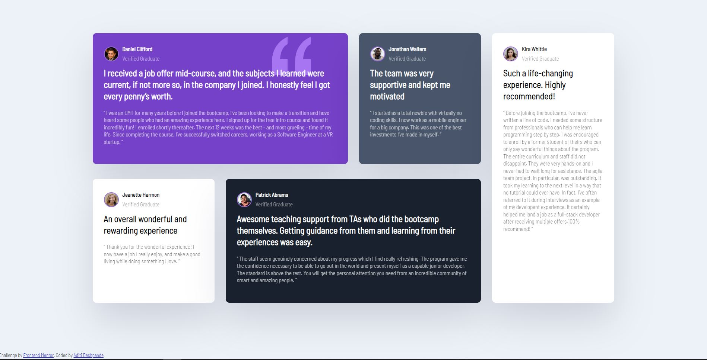

# Frontend Mentor - Testimonials grid section solution

## Table of contents

- [Overview](#overview)
  - [The challenge](#the-challenge)
  - [Screenshot](#screenshot)
  - [Links](#links)
- [My process](#my-process)
  - [Built with](#built-with)
  - [What I learned](#what-i-learned)
  - [Continued development](#continued-development)
  - [Useful resources](#useful-resources)
- [Author](#author)


## Overview

### The challenge

Users should be able to:

- View the optimal layout for the site depending on their device's screen size

### Screenshot




### Links

- Solution URL: [Grid-Challenge](https://aditi002-holo.github.io/frontend-mentor-grid-section/)

## My process

### Built with

- Semantic HTML5 markup
- CSS custom properties
- Flexbox
- CSS Grid


### What I learned

I learned to work on grid and flexbox through this project. 

I found arranging grid's content with grid- column and grid-row properties challenging but extremely fun at the same time!

```css
.card:nth-of-type(1) {
    grid-column: 1 / 3;
}

.card:nth-of-type(4) {
    grid-column: 2 / 4;
    grid-row: 2;
}

.card:nth-of-type(5) {
    grid-column: 4;
    grid-row: 1 / 3;
}
```

### Continued development

I want to focus on responsiveness in my future projects as it can be intimidating at times.


### Useful resources

- [Visual GRID](https://grid.malven.co/) - This site helped me visualize the grid-row properties.


## Author

- Frontend Mentor - [@Aditi002-holo](https://www.frontendmentor.io/profile/Aditi002-holo)
- Twitter - [@aditiintechk](https://twitter.com/aditiintechk)

