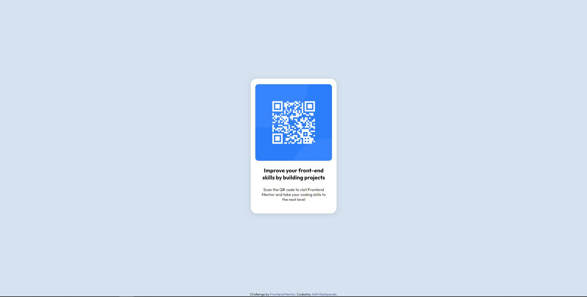

# Frontend Mentor - QR code component solution

Built a simple QR Code Component using HTML & CSS.

## Screenshot

## Links

- Solution URL: [Solution](https://aditi002-holo.github.io/qr-component/)

## Built with

- Semantic HTML5
- CSS
- Flexbox

## Author

- Frontend Mentor - [@Aditi002-holo](https://www.frontendmentor.io/profile/Aditi002-holo)
- Twitter - [@aditiintechk](https://twitter.com/aditiintechk)
